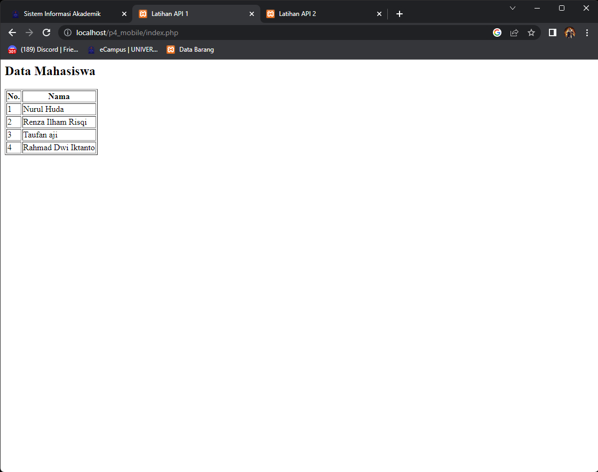
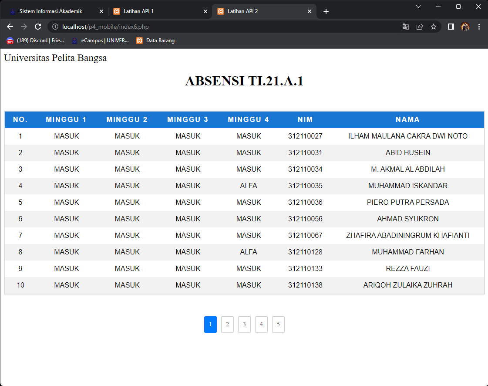

# Tugas P4 Latihan API
Nama : Iman Setiawan\
NIM : 312110219\
Kelas : TI.21.A1\
Matkul : Pemograman Mobile 2

## Latihan API 1

Berikut adalah contoh menarik api ke website, yang link API-nya adalah (https://tifupb.id/data), terdiri dari 4 data yang berisikan nama-nama mahasiswa. Data API tersebut kemudian ditampilkan pada website menggunakan bahasa pemograman PHP.

## Latihan API 2

Contoh kedua adalah lanjutan dari contoh menarik api ke website, yang link API-nya adalah (https://tifupb.id/tugas1). Berbeda dengan API Latihan 1, Link API tersebut memiliki banyak data, dan di tampilkan ke sebuah website menggunakan bahasa pemograman PHP serta membuat lebih menarik dengan menambahkan CSS pada baris kodenya.

